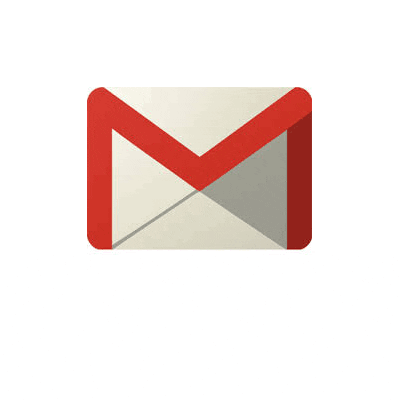
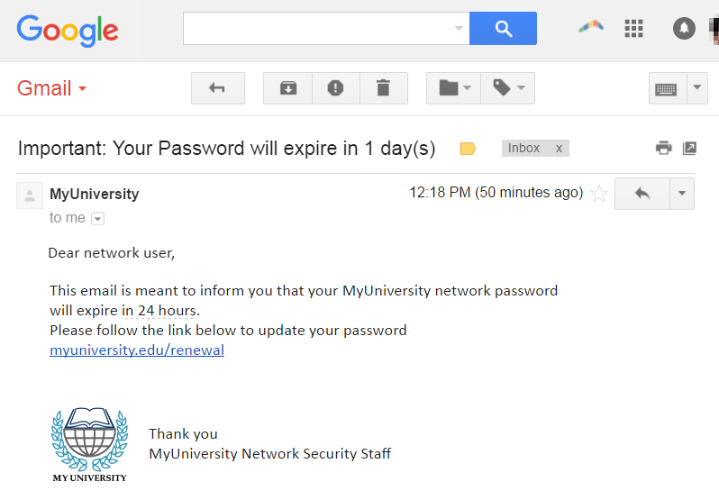
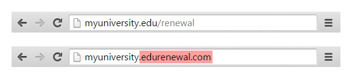
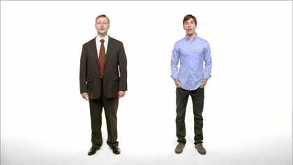

# how secure is secure

- why attack us
- who can attack us
- attack vectors
- what we should do now

---

# fair warning

- high concentration of GIFs
- cultural references

---

# Attack!
# but why to attack us?

---

---

# 1. user data

- emails
- company ransom

---

# 2. company's intellectual property

---

# 3. access to money transfer / company assets

- emails
- company ransom

---

# 4. ...for lulz

---

# who can attack us

---

# anyone between...

---

# ...and

i.e. does not really matter

---

# attack vectors 

$$ V = [v_1, v_2, ... v_n] $$

---

# social engineering

---

# phishing 🎣

1. you get email
2. email tells you to do something (usually URGENTLY)
3. you do it
4. :(

---

---

---

---

---

---

---

---

# oh wait

---

---

---

---

---

# good news

#### it was me
#### majority detected it
#### a lot of people reported it to me

---

# bad news 

#### 28 clicked the link
#### 2 people entered their password on the page

---

# _one of them was dev with full access_

---

# _one of them was one of_
### _CEO, CFO, COO, CTO_

---

# how to detect phishing (1)

- wrong sender: always check sender domain
    - Good: Paypal email from ...@paypal.com
    - Bad: Paypal email from ...@paypal.**adminpp.com**
- opening the wrong website
    - Good: paypal email opens paypal.com
    - Bad: paypal email opens paypal.**info-pp.jp**

---

# how to detect phishing (2)

- sketchy formatting
- not personalized: `Dear sir/madam` instead of your name
- sometimes: requires immediate action
- attachment that you supposed to immediately open and review

---

# counter-measures

- awareness (so, this talk)
- check sender, etc.
- if immediate action is required, do not follow the links in the email, just go to the service directly
- additional security measures on the mail server

---

# lost hardware

- contains your data
- _contains patient data or access to patient data_

---

# counter-measures

- encrypt your disk with [FileVault](https://docs.google.com/document/d/1han3RIeJQRaDMFHWbw7JppMRqqURNDPUfuBT3gDR7tU/edit)
- never leave your laptop unattended
- in the new office: personal lockers

---

# working in public with patient data

### in cafes or when someone external can look on your screen

- just don't do it please

---

# direct attack on the server

mistake / misconfiguration allow attacker to access our patient database

---

# counter-measures

- code review
- extenral security audit
- public bounty for the discovered vulnerabilities

---

# virus attack

---

---

# shared passwords

---

# counter-measures

we'll rotate the shared passwords when someone is leaving the company
_please do not save the shared passwords to your password manager_

---

# recap (1)

- mind the phishing
- never run any app that you've got as an email
- encrypt your hard drive(s)
- never leave your laptop unattended
- do not work in public with patient data

---

# recap (2)

- never send anyone patient data
- never send passwords in Slack
- never send patient data in Slack
- do not save shared passwords
- if in doubt, ask me
- use 2-factor-auth

